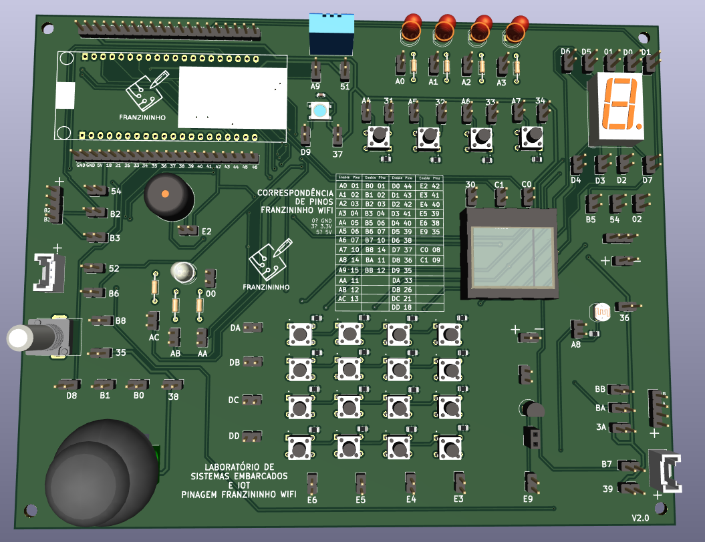
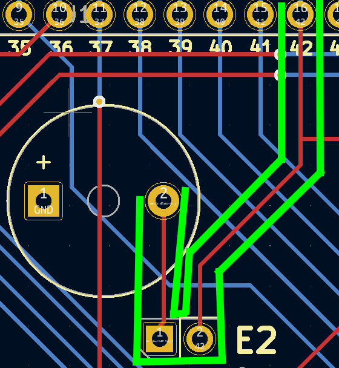
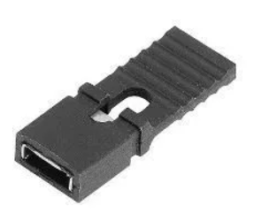

## Laboratório de Sistemas Embarcados e IoT - Franzininho Wifi

## O que é este projeto?

O projeto **Laboratório de Sistemas Embarcados e IoT** é um projeto de placa de circuito impresso para facilitar o uso de componentes eletrônicos em oficinas de programação. Este projeto possui um socket para conexão da placa [Franzininho Wifi](https://github.com/Franzininho/Franzininho-WiFi) e diversos periféricos conectados à pinos pré-determinados do socket que podem ser ativados utilizando um conector jumper ou mais.

Esse projeto tem o intuito de auxiliar no ensino de programação utilizando placas microcontroladas já que muitas vezes nas oficinas de programação com placas microcontroladas é despendido muito tempo para lidar com problemas que vem da manipulação do hardware como utilização da protoabord e realização de conexões. Este tempo muitas vezes acaba prejudicando a atividade já que o tempo onde se foca em fazer as conexões eletrônicas poderia ser melhor aproveitado focando na programação realmente.

Sendo assim, utilizando a facilidade de conexão de periféridos da placa é possível reduzir drásticamente o tempo despendido para conexões eletrônicas, focando no objetivo da oficina, que é a programação.

## Como ativar os periféricos?

Os periféricos utilizados na placa são ativados através de pinos de ativação. Esses pinos são compostos por dois pinos macho que devem ser conectados. Um desses pinos macho está conectado ao socket da placa e o outro a um pino do componente eletrônico. Dessa forma, o jumper fecha a conexão entre o componente e a placa microcontrolada. Uma exemplo desse tipo de conexão está evidenciado na figura abaixo pelas linhas verdes:

Como "ativador" para os pinos, recomendo o uso do conector da imagem abaixo. Você pode encontrar esse conector como "jumper com aba", "mini jumper com aba", "jumper cap", entre outros.

Além dos pinos de ativação de sinal que conectam o componente ao socket da placa, existem também os pinos de ativação de energia que são responsáveis por energizar o componente.

## Codificação dos pinos de ativação

Devido à quantidade de pinos de ativação usada na placa, foi preciso desenvolver um sistema de codificação para esses pinos. Esse sistema foi idealizado com cada pino sendo representado por dois algorismos. O primeiro indicando a funcionalidade do pino e o segundo indicando uma numeração do pino. As funções dos primeiros algorismos podem ser vistas abaixo:

| Letra |                     Significado                      |
| :---: | :--------------------------------------------------: |
|   0   |                         GND                          |
|   3   |                       VCC 3.3V                       |
|   5   |                        VCC 5V                        |
|   A   |                   Pinos analógicos                   |
|   B   | Pinos conectados em um mesmo pino identificado por A |
|   C   |                      Especiais                       |
|   D   |                    Pinos digitais                    |
|   E   | Pinos conectados em um mesmo pino identificado por D |

O código correspondente a cada pino de ativação foi impresso ao lado desse pino e o mapeamento dos pinos de ativação para os pinos da placa Franzininho Wifi está impresso na placa e também pode ser acessado [clicando aqui](./informacoes/mapeamento.md). Além disso, também foi desenvolvida uma biblioteca para uso em conjunto com a placa que permite o uso dos códigos dos pinos de ativação dentro da programação. [Clique aqui para acessar a **biblioteca laboratorioFW**](https://github.com/Franzininho/biblioteca-laboratorioFW)

A lista dos periféricos disponíveis e dos pinos de ativação necessários para ativar esses periféricos pode ser acessada [clicando aqui](./informacoes/ativacao-perifericos.md). É importante lembrar que além dos periféricos a placa também conta com conectores para sensores e atuadores externos no formato de pinos macho e de conectores Grove.

## Como o projeto foi desenvolvido?

O projeto foi desenvolvido com o software [KiCad 7](https://www.kicad.org/). Esse software é aberto e está disponível para Linux, MacOS e Windows.

## Adaptadores

Buscando aumentar ainda mais a versatilidade do projeto, estão sendo desenvolvidos adaptadores para a placa que permitem a conexão dela com outras placas microcontroladas.

### Placas adaptadoras desenvolvidas até o momento:

-   [Arduino Uno](https://github.com/Franzininho/laboratorio-SEIoT-adaptador-arduino)

---

#### Feito por [LelePG](https://github.com/LelePG)
