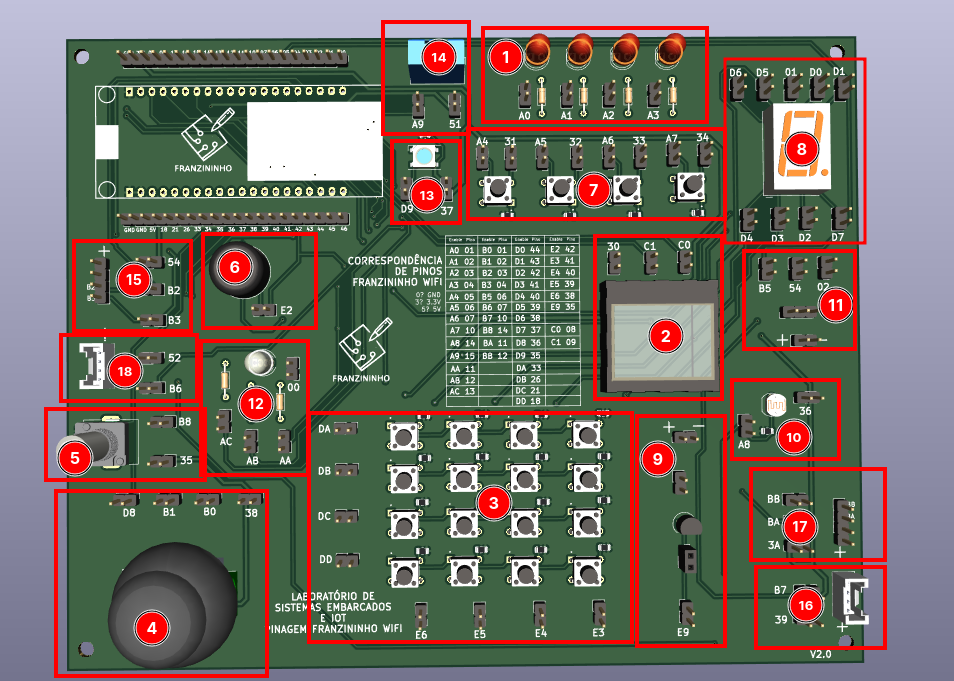

|              Periferico               |                     Pinos de Ativação                     | Código na imagem |
| :-----------------------------------: | :-------------------------------------------------------: | :--------------: |
|             LEDs difusos              |         A0,A1,A2,A3 (dependendo do LED escolhido)         |        1         |
|                Botões                 |        A4,A5,A6,A7 (dependendo do botão escolhido)        |        7         |
|                Buzzer                 |                            E2                             |        6         |
|                LED RGB                |                        AC,AB,AA,00                        |        12        |
|             Potenciômetro             |                           B8,35                           |        5         |
|        Sensor de luminosidade         |                           A8,36                           |        10        |
| Sensor de umidade e temperatura DTH11 |                          A9, 51                           |        14        |
|        Display de 7 segmentos         |                D0,D1,D2,D3,D4,D5,D6,D7, 01                |        8         |
|            Transistor NPN             |                            E9                             |        9         |
|             Display OLED              |                         C0,C1,30                          |        2         |
|           Teclado Matricial           |                   DA,DB,DC,DD,E6,E4,E3                    |        3         |
|       Conexão para Servo Motor        |                         B5,54,02                          |        11        |
|          LED RGB endereçável          |                           D9,37                           |        13        |
|            Módulo Joystick            |                        D8,B1,B0,38                        |        4         |
|      Conectores fêmea de 4 pinos      | (BA,BB,3A) ou (B3,B2,54) dependendo do conector escolhido |     17 e 15      |
|           Conectores Grove            |   (B7, 39) OU (52, B6) dependendo do conector escolhido   |     16 e 18      |

